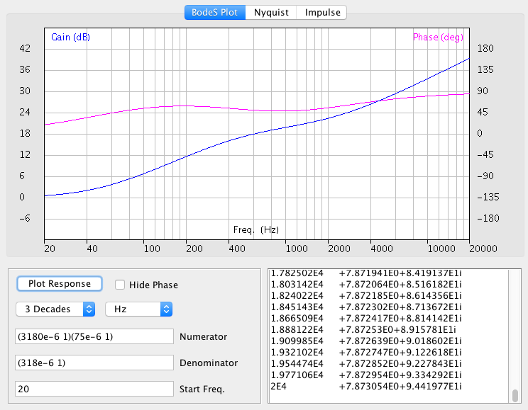
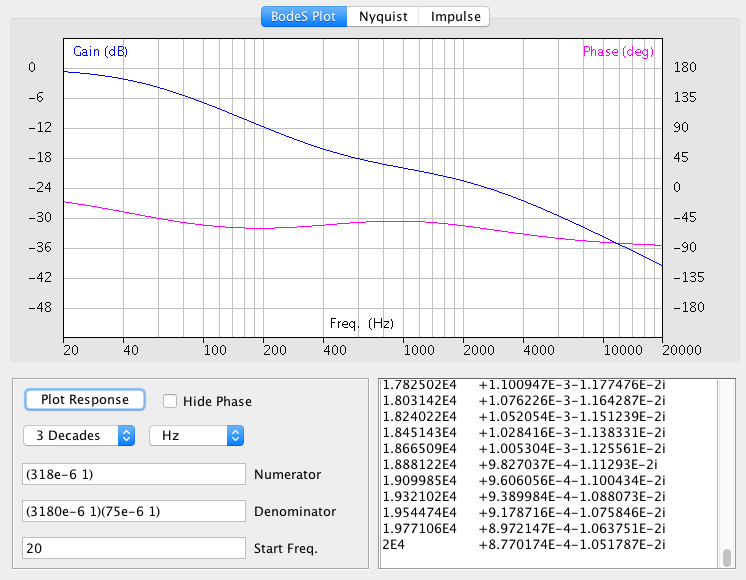

# Using BodeS to Plot an RIAA Filter

When playing vinyl records on a turntable, one must remember that manufacturers use [equalization](https://en.wikipedia.org/wiki/RIAA_equalization) when recording to optimize dynamic range and headroom. This pre-emphasis curve is defined by the Recording Industry Association of America (RIAA) as a transfer function with three time constants. The time constants are defined as follows:

| Symbol | Value (usec) |
| ------ | ----- |
| $T_1$  | 3180  |
| $T_2$  |  318  |
| $T_3$  |   75  |

The pre-emphasis curve used for recording is defined with this second-order transfer function, having two zeros and one pole:

```math
H(s) = \frac{\left(sT_1+1\right)\left(sT_3+1\right)}{\left(sT_2+1\right)}
```

On playback, one can then invert the transfer function to implement a de-emphasis filter for playback, recovering the original sound with optimized dynamic range and headroom. This transfer function has one zero and two poles:

```math
H(s) = \frac{\left(sT_2+1\right)}{\left(sT_1+1\right)\left(sT_3+1\right)}
```

To use the BodeS Java app to plot the RIAA pre-emphasis curve used for recording, follow these steps:

- Build and run the Java app BodeS. <[How to Build BodeS](HowToBuild.md)>
- Copy and paste these coefficients into the "Numerator" field, replacing previous contents:
```
(3180e-6 1)(75e-6 1)
```
- Copy and paste these coefficients into the "Denominator" field, replacing previous contents:
```
(318e-6 1)
```
- Set the "Start Freq." field to 20.
- Set the range control to "3 Decades".
- Click the "Plot Response" button to redraw the plot image.



To use the BodeS Java app to plot the RIAA de-emphasis curve used for playback, follow these steps:

- Build and run the Java app BodeS. <[How to Build BodeS](HowToBuild.md)>
- Copy and paste these coefficients into the "Numerator" field, replacing previous contents:
```
(318e-6 1)
```
- Copy and paste these coefficients into the "Denominator" field, replacing previous contents:
```
(3180e-6 1)(75e-6 1)
```
- Set the "Start Freq." field to 20.
- Set the range control to "3 Decades".
- Click the "Plot Response" button to redraw the plot image.



It's ok to run two copies of the BodeS app, to compare the two equalization curves side-by-side. Just be sure to populate all fields in both copies.
